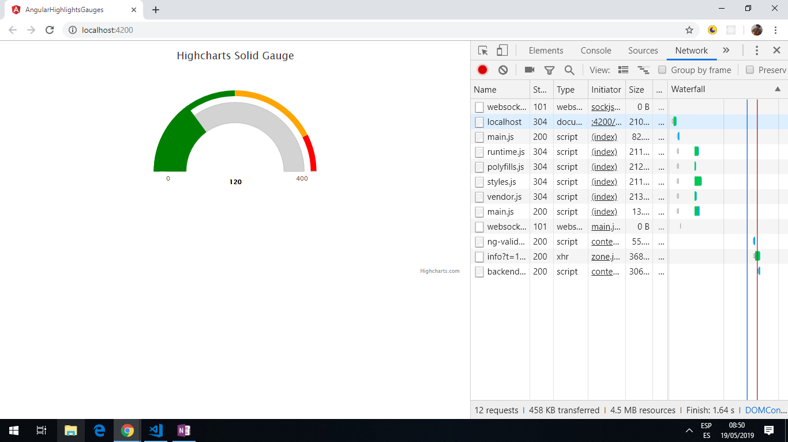

# :zap: Angular Highcharts Gauges

* Angular 12 app using the [Highcharts](https://www.highcharts.com/) API to visualise data.
* Displays a gauge, configurable from the `app.component.ts` file using values from [Highcharts documentation](https://api.highcharts.com/highcharts/chart#).
* Code from [Sunny Sun, Medium](https://medium.com/@sunnysun_5694) - see [:clap: Inspiration](#clap-inspiration) below
* **Note:** to open web links in a new window use: _ctrl+click on link_


## :page_facing_up: Table of contents

* [General info](#general-info)
* [Screenshots](#screenshots)
* [Technologies](#technologies)
* [Setup](#setup)
* [Features](#features)
* [Status](#status)
* [Inspiration](#inspiration)
* [Contact](#contact)

## :books: General info

* Latest versions of all dependencies used, including highcharts. With some type changes in app-module there are now no errors.
* This simple app works but it is not the optimal coding solution as it does not use the latest Highcharts Angular wrapper.

## :camera: Screenshots



## :signal_strength: Technologies

* [Angular framework v12](https://angular.io/)
* [Highcharts v9](https://www.highcharts.com/)

## :floppy_disk: Setup

* Run `npm i` to install dependencies
* Run `ng serve` for a dev server. Navigate to `http://localhost:4200/`. The app will automatically reload if you change any of the source files.
* Run 'ng build' to create a build file

## :computer: Code Examples

* extract from `app.component.ts` - defines the plotband values and colours.

```typescript
plotBands: [
  { from: 0, to: 200, color: 'green' },
  { from: 200, to: 340, color: 'orange' },
  { from: 340, to: 400, color: 'red' }
]
```

## :cool: Features

* [Highcharts gauges](https://www.highcharts.com/) have other types of gauges and lots of options that can be configured.

## :clipboard: Status & To-Do List

* Status: Working. Updated may 2021.
* To-Do: Nothing

## :clap: Inspiration

* [Medium blog by Sunny Sun: How to create impressive looking Gauge Charts using Angular 6, dec 24, 2018](https://medium.com/@sunnysun_5694/how-to-create-impressive-looking-gauge-charts-using-angular-6-8f91dfd6fc5c)

## :file_folder: License

* This project is licensed under the terms of the MIT license.

## :envelope: Contact

* Repo created by [ABateman](https://github.com/AndrewJBateman), email: gomezbateman@yahoo.com
