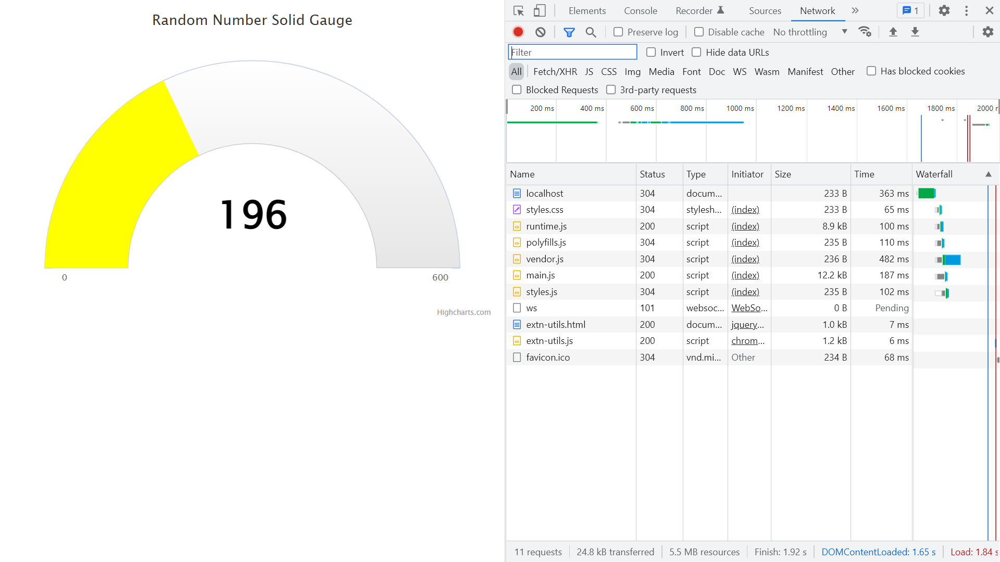

# Angular Highcharts Gauges

Angular app using the [Highcharts](https://www.highcharts.com/) API to visualise data.

*** Note: to open web links in a new window use: _ctrl+click on link_**

## Table of contents

* [General info](#general-info)
* [Screenshots](#screenshots)
* [Technologies](#technologies)
* [Setup](#setup)
* [Features](#features)
* [Status](#status)
* [Inspiration](#inspiration)
* [Contact](#contact)

## General info

* Version 6.2.6 of npm Highcharts directive angular-highcharts. Latest version of module caused a breaking error.

## Screenshots



## Technologies

* [Angular CLI v8.0.1](https://github.com/angular/angular-cli)

* [Angular framework v8.0.0](https://angular.io/)

* [highcharts v7.1.2](https://www.highcharts.com/)

* [angular-highcharts v 8.0.2](https://www.npmjs.com/package/angular-highcharts)

## Setup

Run `ng serve` for a dev server. Navigate to `http://localhost:4200/`. The app will automatically reload if you change any of the source files.

## Code Examples

* app.component.ts - defines the plotband values and colours.

```typescript
plotBands: [
  { from: 0, to: 200, color: 'green' },
  { from: 200, to: 340, color: 'orange' },
  { from: 340, to: 400, color: 'red' }
]
```

## Features

* highcharts gauges have other types of gauges and lots of option that can be configured.

## Status & To-Do List

* Status: basic working app that displays a gauge, configurable from the `app.component.ts` file using values from [Highcharts documentation](https://api.highcharts.com/highcharts/chart#).

* To-Do: create new repo with latest versions. Add functionality and extend to include connection to an API.

## Inspiration

* [Medium blog by Sunny Sun: How to create impressive looking Gauge Charts using Angular 6](https://medium.com/@sunnysun_5694/how-to-create-impressive-looking-gauge-charts-using-angular-6-8f91dfd6fc5c)

## Contact

Repo created by [ABateman](https://www.andrewbateman.org) - feel free to contact me!
